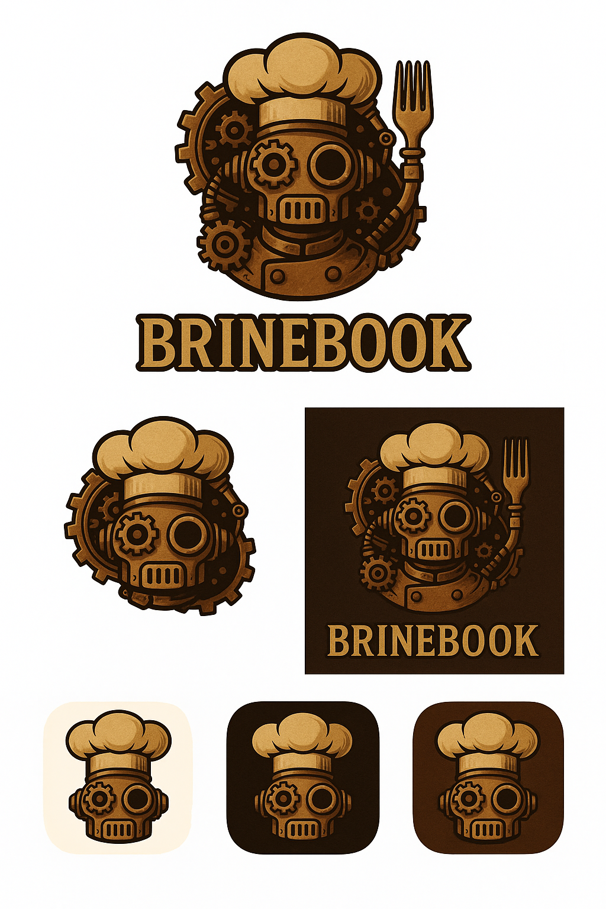

````markdown
<div align="center">
  
</div>

# BrineBook

**Your AI-powered, restaurant-style recipe vault**

BrineBook lets you generate, store, rate, tag, and rediscover restaurant-quality recipes—especially ones sourced from LLMs—without losing them in random chats.

## Features

- 🤖 **AI-Powered Recipe Generation**: Use ChatGPT to generate restaurant-quality recipes with structured prompts
- 🔍 **Universal Search**: Single search bar that searches both your saved recipes and can generate new ones
- 🏷️ **Smart Tagging**: Organize recipes with cuisine, protein, style, difficulty, equipment, and custom tags
- 📸 **Photo Gallery**: Attach multiple photos to track how your dishes turn out
- ⭐ **Rating System**: Score recipes and add notes to refine them over time
- 🎯 **Command Palette**: Keyboard shortcuts for power users (`Ctrl/Cmd+K`)

## Quick Start

### Prerequisites

- Docker & Docker Compose
- Node.js 18+ (for local frontend development)
- Python 3.11+ (for local backend development)

### Environment Setup

1. Copy the example environment file:

```bash
cp .env.example .env
```

2. Add your OpenAI API key to `.env`:

```env
OPENAI_API_KEY=sk-your-key-here
```

### Run with Docker

```bash
docker-compose up -d
```

The application will be available at:

- Frontend: http://localhost:5173
- Backend API: http://localhost:8000
- API Docs: http://localhost:8000/docs

### Local Development

#### Backend

```bash
cd backend
python -m venv venv
source venv/bin/activate  # or `venv\Scripts\activate` on Windows
pip install -r requirements.txt

# Run migrations
alembic upgrade head

# Start server
uvicorn app.main:app --reload
```

#### Frontend

```bash
cd frontend
npm install
npm run dev
```

## Project Structure

```
brinebook/
├── backend/              # FastAPI backend
│   ├── app/
│   │   ├── api/         # API routes
│   │   ├── core/        # Config, security, database
│   │   ├── models/      # SQLAlchemy models
│   │   ├── schemas/     # Pydantic schemas
│   │   └── services/    # Business logic, LLM integration
│   ├── alembic/         # Database migrations
│   └── tests/
├── frontend/            # Vue 3 frontend
│   ├── src/
│   │   ├── components/  # Vue components
│   │   ├── views/       # Page views
│   │   ├── stores/      # Pinia stores
│   │   ├── api/         # API client
│   │   └── router/      # Vue Router
│   └── public/
└── docker-compose.yml
```

## Core Workflows

### 1. Generate Recipe from AI

1. Type your query in the universal search bar: `restaurant style tuscan chicken`
2. Click "Generate with AI" if no existing recipes match
3. Review the generated recipe
4. Edit, add tags, and save

### 2. Save & Organize

- Add tags for cuisine, protein, style, difficulty, equipment
- Label recipes by occasion and status
- Original prompts are stored for traceability

### 3. Add Photos

- Upload multiple photos per recipe
- Set a hero image
- Add captions to track versions

### 4. Rate & Refine

- Rate recipes 1-5 stars
- Add notes: "Too salty", "Perfect for service"
- Use ratings to sort and filter

### 5. Universal Search

- Natural language: `tuscan chicken`, `keeper recipes`, `smoker pork`
- Commands:
  - `/new "restaurant style chicken francaise"` - Generate new recipe
  - `/revise <recipe>` - Send to AI for improvements
  - `/menu "Italian night for 20"` - Build menu from your recipes

## API Documentation

Once running, visit http://localhost:8000/docs for interactive API documentation.

## Tech Stack

- **Frontend**: Vue 3, Vite, Pinia, Vue Router, TailwindCSS
- **Backend**: FastAPI, SQLAlchemy, Alembic
- **Database**: PostgreSQL with full-text search
- **Storage**: S3-compatible (AWS S3 or Wasabi)
- **AI**: OpenAI API with structured prompts
- **Auth**: JWT tokens

## License

MIT
````
